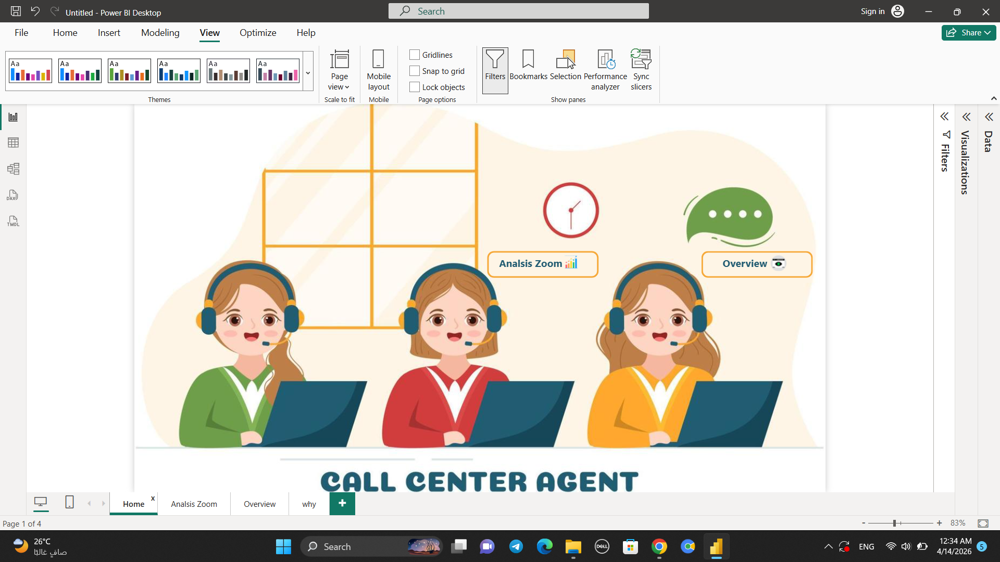
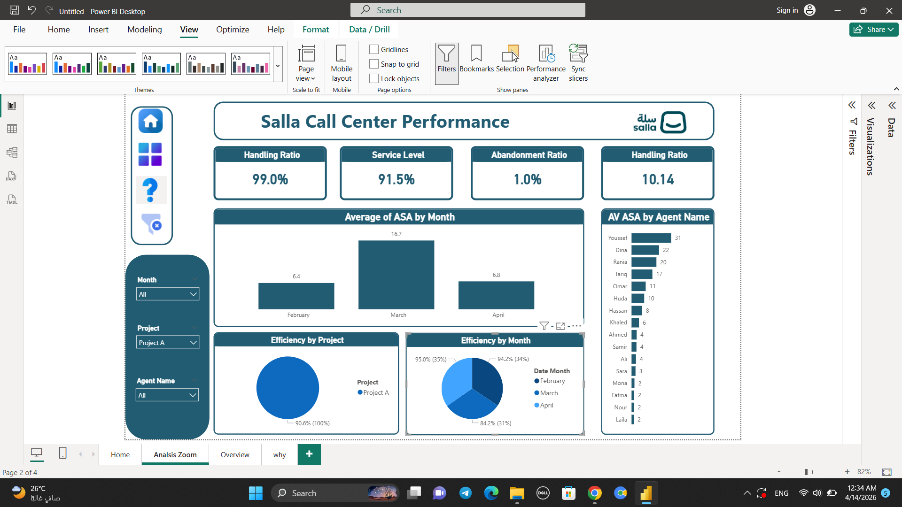
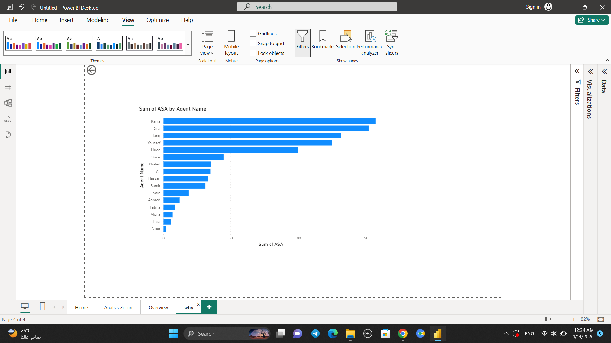

# My First Project By Power BI

## 📊 Project Overview
This project is an interactive dashboard created using Power BI to analyze sales data and business performance.  
The dashboard provides visual insights that help understand trends, customer behavior, and key business KPIs.

---

## 🛠 Tools & Technologies Used
- Power BI
- Python
- SQL
- Excel

---

## 📷 Dashboard Preview

### Screenshot 1

### Screenshot 2

### Screenshot 3

---

## 📈 Key Insights
- Identified top-selling products
- Analyzed sales and revenue trends
- Compared business performance across categories
- Visualized important KPIs clearly
- Improved understanding of customer behavior

---

## 🎯 Project Goals
- Transform raw data into useful business insights
- Build an interactive and easy-to-use dashboard
- Practice data visualization and analytics skills

---

## 📂 Project Files
- `Salla Project By Power BI.pbix`
- `img1.png`
- `img2.png`
- `img3.png`

---

## 👨‍💻 Author
Mohamed Mahmoud

- GitHub: https://github.com/mmaamh1111-ui
- LinkedIn: https://www.linkedin.com/in/mohamed-abozaid-741a29379
